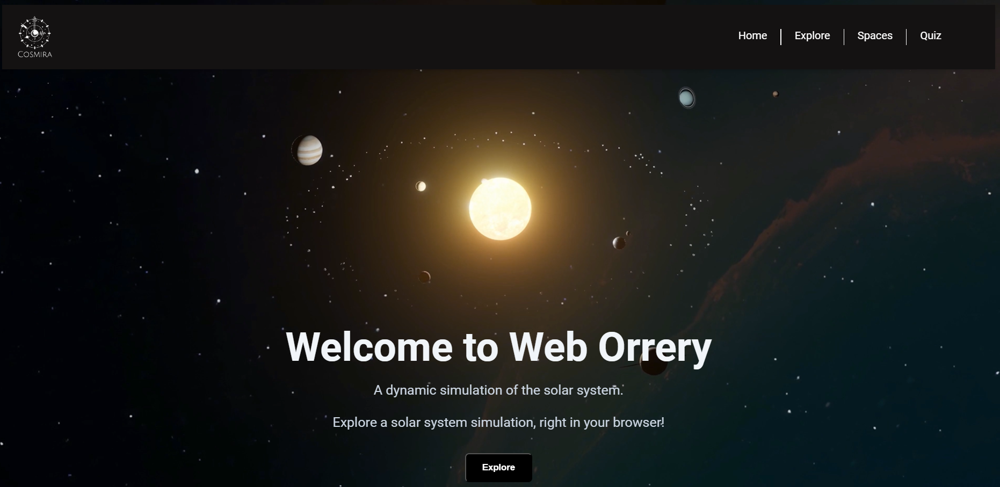
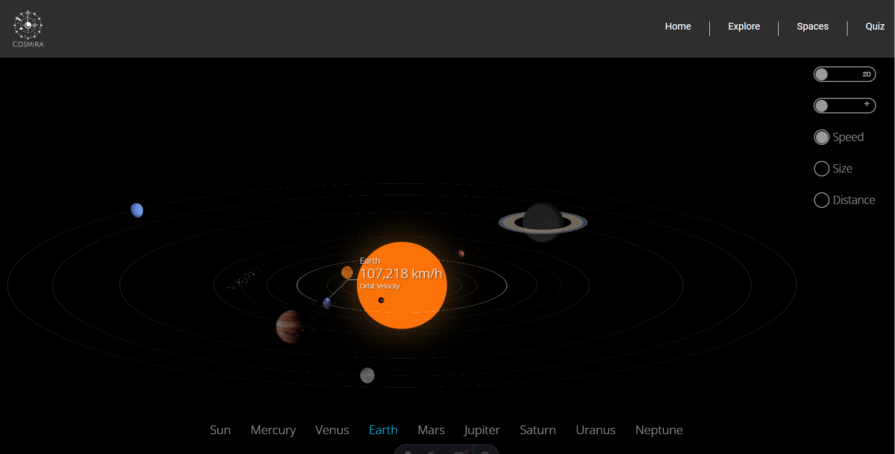
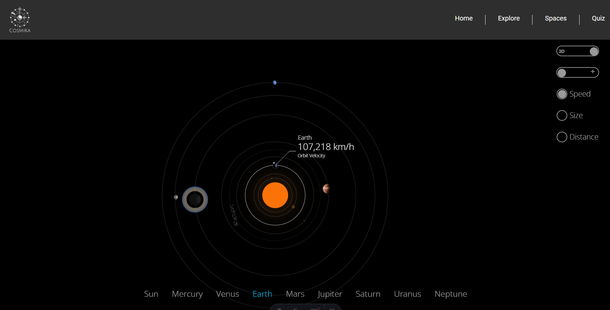
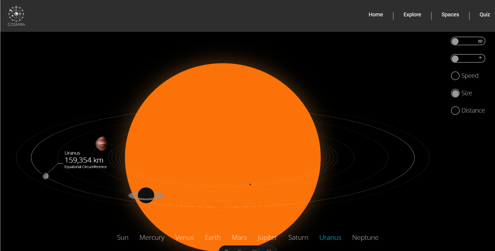
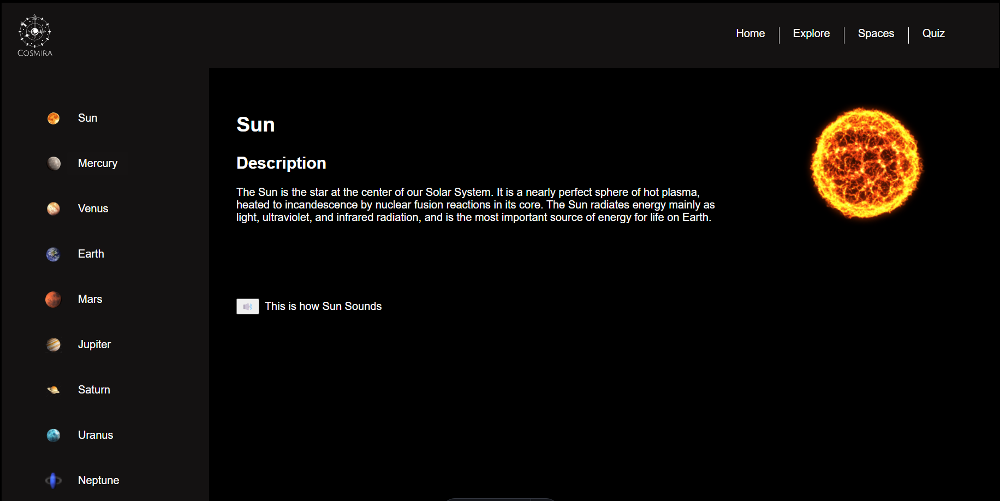
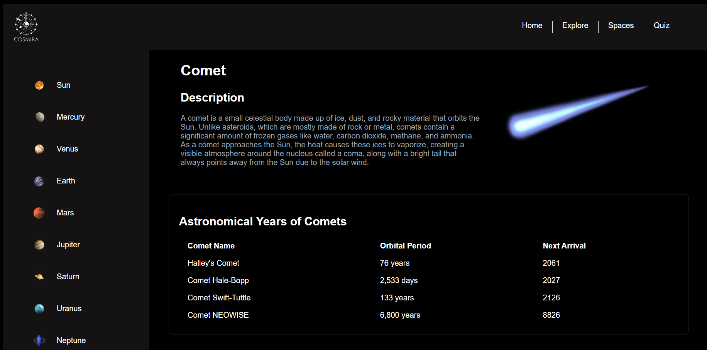
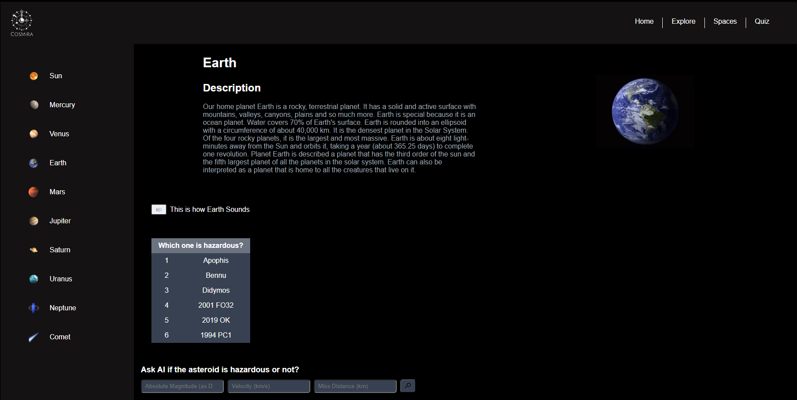
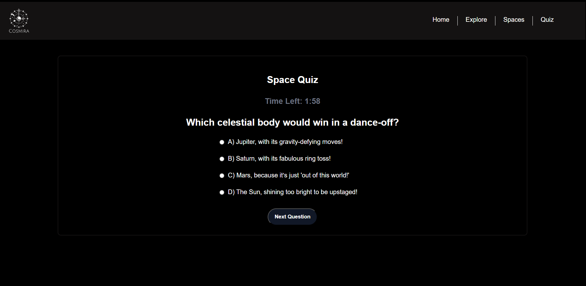

# Orrery Web App

Welcome to the Orrery Web App! This project is a web-based application developed using **Astro**, **JavaScript**, and **Tailwind CSS**. The app serves as an educational tool to explore our solar system in an engaging and interactive way.

## Table of Contents

- [Orrery Web App](#orrery-web-app)
  - [Table of Contents](#table-of-contents)
  - [Features](#features)
  - [Technologies Used](#technologies-used)
  - [Getting Started](#getting-started)
  - [🧞 Commands](#-commands)
  - [👀 Want to learn more?](#-want-to-learn-more)
  - [Some Screenshots of Our project.](#some-screenshots-of-our-project)

## Features

- **Landing Page:** An inviting landing page that introduces users to the app.
- **Explore Page:** A simulated 2D solar system that visually resembles a 3D representation, featuring:
  - The Sun as a reference point for measuring distances, orbital velocities, and equatorial circumferences.
  - Dedicated pages for each member of the solar system with relevant information.
  - Sounds captured by NASA for each celestial body.
- **Asteroids and Comets Data:** Information about various asteroids and comets, including their astronomical timings and potential hazards.
- **Quiz Game:** A fun and interactive quiz that helps kids learn about the solar system in an engaging way.

## Technologies Used

- **React:** A JavaScript library for building user interfaces.
- **JavaScript:** The programming language used for application logic.
- **Tailwind CSS:** A utility-first CSS framework for styling the application.
- **NASA APIs:** To gather data and sound recordings of celestial bodies.

## Getting Started

## 🧞 Commands

All commands are run from the root of the project, from a terminal:

| Command                   | Action                                           |
| :------------------------ | :----------------------------------------------- |
| `npm install`             | Installs dependencies                            |
| `npm run dev`             | Starts local dev server at `localhost:4321`      |
| `npm run build`           | Build your production site to `./dist/`          |
| `npm run preview`         | Preview your build locally, before deploying     |
| `npm run astro ...`       | Run CLI commands like `astro add`, `astro check` |
| `npm run astro -- --help` | Get help using the Astro CLI                     |

## 👀 Want to learn more?

Feel free to check [our documentation](https://docs.astro.build) or jump into our [Discord server](https://astro.build/chat).

## Some Screenshots of Our project.

<!-- label -->

_Landing Page_

*Explore Page*

 *Space Page*

  *Asteroids and Comets Data*

            *Quiz Game*

<!-- label-end -->

_The End_

